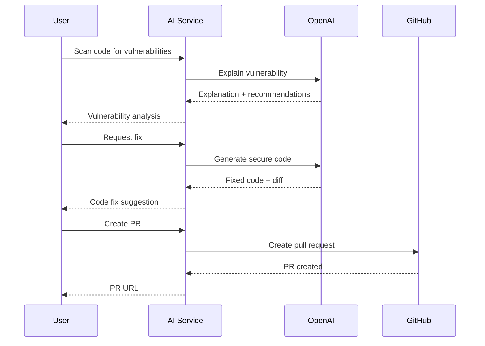

# AI Service - Hackathon Demo

This service demonstrates AI-powered vulnerability fixing and automated PR generation for the hackathon.

## Quick Start

### 1. Set Up Environment

```bash
# Copy the example env file
cp services/ai-service/.env.example services/ai-service/.env

# Edit .env and add your OpenAI API key
OPENAI_API_KEY=sk-your-key-here
```

### 2. Start the Service

```bash
# Install dependencies (if not already done)
pnpm install

# Start the AI service
cd services/ai-service
pnpm dev
```

The service will run on `http://localhost:3004`

### 3. Test the Endpoints

#### Health Check

```bash
curl http://localhost:3004/health
```

#### Explain Vulnerability

```bash
curl -X POST http://localhost:3004/api/ai/explain \
  -H "Content-Type: application/json" \
  -d '{
    "vulnerabilityId": "vuln-001",
    "context": {
      "code": "const query = \"SELECT * FROM users WHERE id = \" + userId;",
      "language": "javascript",
      "severity": "high",
      "type": "sql-injection"
    }
  }'
```

#### Generate Fix

```bash
curl -X POST http://localhost:3004/api/ai/fix \
  -H "Content-Type: application/json" \
  -d '{
    "vulnerabilityId": "vuln-001",
    "includeTests": true
  }'
```

#### Create Pull Request

```bash
curl -X POST http://localhost:3004/api/ai/generate-pr \
  -H "Content-Type: application/json" \
  -d '{
    "vulnerabilityIds": ["vuln-001", "vuln-002"],
    "title": "Security fixes for SQL injection vulnerabilities",
    "description": "Automated fixes generated by AI for critical security issues"
  }'
```

## Demo Features

### 1. AI-Powered Vulnerability Analysis

- Uses GPT-4 to explain security vulnerabilities
- Provides impact assessment and recommendations
- Returns confidence scores for AI analysis

### 2. Automated Code Fixing

- Generates secure code replacements
- Creates diffs showing changes
- Optionally includes test cases
- Uses lower temperature (0.3) for deterministic fixes

### 3. Pull Request Generation

- Combines multiple fixes into a single PR
- Generates descriptive PR descriptions
- Tracks files changed and lines modified
- Returns GitHub PR URL for review

## Architecture

```
AI Service (Port 3004)
├── POST /api/ai/explain       - Explain vulnerabilities
├── POST /api/ai/fix           - Generate code fixes
└── POST /api/ai/generate-pr   - Create PRs with fixes

Dependencies:
- OpenAI API (GPT-4)
- GitHub API (Octokit)
- Shared packages (@cybersec/types, @cybersec/utils, @cybersec/config)
```

## Demo Workflow



## Key Implementation Details

### Lazy Initialization

The service uses lazy initialization for OpenAI and GitHub clients to avoid errors when API keys are not configured. The service will start successfully and only throw errors when endpoints requiring API keys are called.

### Mock Data for Demo

Currently uses mock vulnerability data for demonstration. In production, this would integrate with the scanner service to fetch real vulnerability data.

### Error Handling

- Comprehensive error handling with custom error classes
- Structured logging with context
- User-friendly error messages
- Proper HTTP status codes

## For Hackathon Judges

### What We Built

A working prototype of an AI-powered security automation service that:

1. Analyzes security vulnerabilities using AI
2. Automatically generates code fixes
3. Creates pull requests with the fixes

### Tech Stack

- **Backend**: Node.js + TypeScript + Express
- **AI**: OpenAI GPT-4
- **Architecture**: Monorepo with Turborepo + pnpm
- **Type Safety**: Comprehensive TypeScript types with Zod validation
- **Error Handling**: Custom error classes with structured logging

### What Makes It Special

- **Type-Safe**: Full TypeScript with runtime validation
- **Production-Ready Architecture**: Shared packages, proper error handling, structured logging
- **AI-Powered**: Leverages GPT-4 for intelligent code analysis and fixes
- **Extensible**: Easy to add more AI features or integrate with other services

### Future Enhancements

- Real GitHub integration for actual PR creation
- Integration with scanner service for live vulnerability detection
- Support for multiple programming languages
- Custom AI models for specific vulnerability types
- Automated testing of generated fixes

## Troubleshooting

### OpenAI API Key Issues

Make sure your `.env` file has the correct API key:

```
OPENAI_API_KEY=sk-...
```

### Port Already in Use

If port 3004 is occupied, change `PORT` in `.env` file.

### TypeScript Errors

Run type checking:

```bash
pnpm run check-types --filter=@cybersec/ai-service
```

## License

MIT
